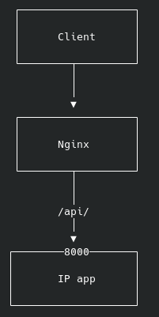
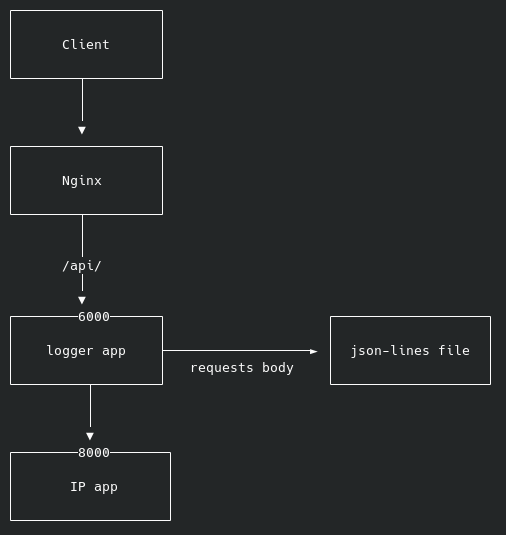
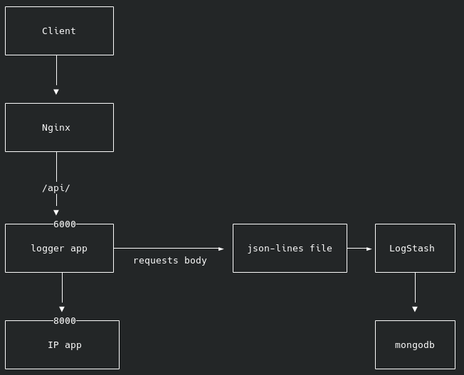
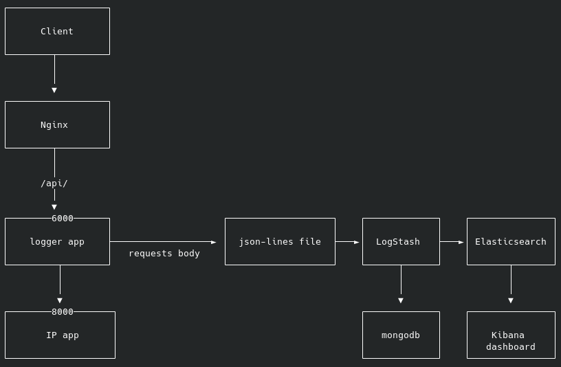
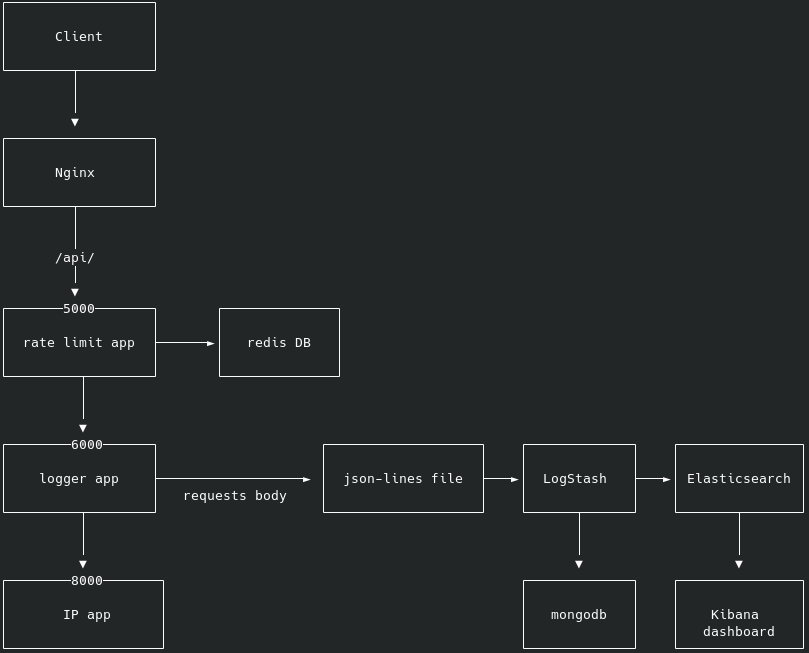

#  پروژه کارآموزی    

### فاز اول:

- در مرحله اول ما به یک ابزار برای ارسال ریکوئست های `http` نیاز داریم (برای مثال ابزار [HTTPie](https://httpie.io/))
- در مرحله دوم ما به `Nginx` نیاز داریم تا در نقش ریورس پروکسی کار کند و ورودی های روت `/api/‍‍`  را به سرویس بعدی بفرستد , `Nginx` باید `ip` کلاینت را نیز در هدر ‍ قرار دهد تا سرویس های بعدی بتوانند به ان دسترسی داشته باشند.
- سرویس `IP app‍‍` یک اندپوینت دارد که در مسیر ‍`/` و با متد `POST` کار میکند, این اندپوینت تمام دیتای داخل `Body` ریکوئست را میگیرد و سپس `IP` کاربر که در هدر  قرار دارد را به ان اضافه میکند و به صورت `json`  بر میگرداند.

- در این مرحله باید تست نویسی انجام شود (تست باید به `nginx` ریکوئست بفرستد و روت را با حالات مختلف تست کند)
- در این مرحله باید کد سرویس, تست `code coverage` شود تا مطمئن شویم تستها کل کد را پوشش میدهند.
- در مرحله اخر باید با ابزار `ApacheBench (ab) ` پروژه را تست لود کرد و ‍`Requests per second‍‍` آن مورد برسی قرار گیرد.

### فاز دوم:

- در مرحله اول ما به یک سرویس `logger` نیاز داریم که یک روت `/` با متود `POST` دارد و بین `nginx` و سرویس ‍`IP app‍‍‍` قرار میگیرد این سرویس به `Body` تمام ریکوئست ها زمان اضافه میکند و ان را در یک فایل با فرمت `json-lines` ذخیره میکند.
- این سرویس باید پس از لاگ کردن `Body` مانند یک ریورس پروکسی عمل کند و ریکوئست کلاینت را به سرویس `IP app` بفرستد (در این مرحله باید ‍`exception handling`  نیز انجام شود تا اگر سرویس `IP app` به مشکل خورده بود این سرویس کرش نکند).
- در این مرحله باید تست های نوشته شده در فاز قبل اپدیت شوند, برسی شود که دیتا بصورت صحیح در فایل ذخیره میشود( تستها باید بصورت مولتی‌ترد باشند و انواع دیتا ها را نیز استفاده کنند).
- در این مرحله باید کد سرویس, تست `code coverage` شود تا مطمئن شویم تستها کل کد را پوشش میدهند.
- در این مرحله باید با ابزار `ApacheBench (ab) ` پروژه را تست لود کرد و ‍`Requests per second‍‍` آن مورد برسی قرار گیرد.
- در مرحله اخر باید با یک ابزار ‍`code profiler` کد تست شود و فانکشن های که  زمان زیادی میگیرد مورد برسی قرار گیرند و در صورت امکان کد ریفکتور شود.

### فاز سوم:

- در این فاز با ابزار `LogStash‍` دیتای که سرویس `logger` در فایلی با فرمت `json-lines` ذخیره میکند را خوانده و در دیتابیس `mongodb` بریزید (از پلاگین mongodb ورژن 3.1.5 استفاده شود).
- در این فاز نیز باید تست شود که دیتاها بصورت صحیح انتقال پیدا میکنند.

### فاز چهارم

- در مرحله اول این فاز باید به `LogStash‍`  یک ‍`output` جدید اضافه شود که لاگهای سرویس `logger app`  را به دیتابیس `Elasticsearch` نیز بفرستد.
- در مرحله بعد باید با ابزار `kibana` یک دشبورد برای تحلیل دیتای  ذخیره شده در`Elasticsearch` ساخته شود.
- در این مرحله باید صحت انتقال دیتا برسی شود.

### فاز پنجم:

- در این فاز باید یک سرویس ‍‍‍‍`Rate Limit` بین `Nginx` و  سرویس `logger app` اضافه شود,  این سرویس با استفاده از یک `Redis DB`   تعداد ریکوئست های که از هر `IP` می‌اید را محدود میکند, به این صورت که هر کلاینت در هر دقیقه فقط میتواند ۱۰۰ ریکوئست بزند.

- این سرویس باید مانند یک ریورس پروکسی عمل کند و در صورتی که ریکوئست مجاز بود ان را به سرویس `logger app` بفرستد (در این مرحله باید ‍`exception handling`  نیز انجام شود تا اگر سرویس `logger app` به مشکل خورده بود این سرویس کرش نکند).

- تست های نوشته شده باید اپدیت شوند تا بتوانند محدودیت های این سرویس را نیز پوشش دهند و انها را نیز بطور کامل برسی کنند.

- در این مرحله باید کد سرویس, تست `code coverage` شود تا مطمئن شویم تستها کل کد را پوشش میدهند.

  

